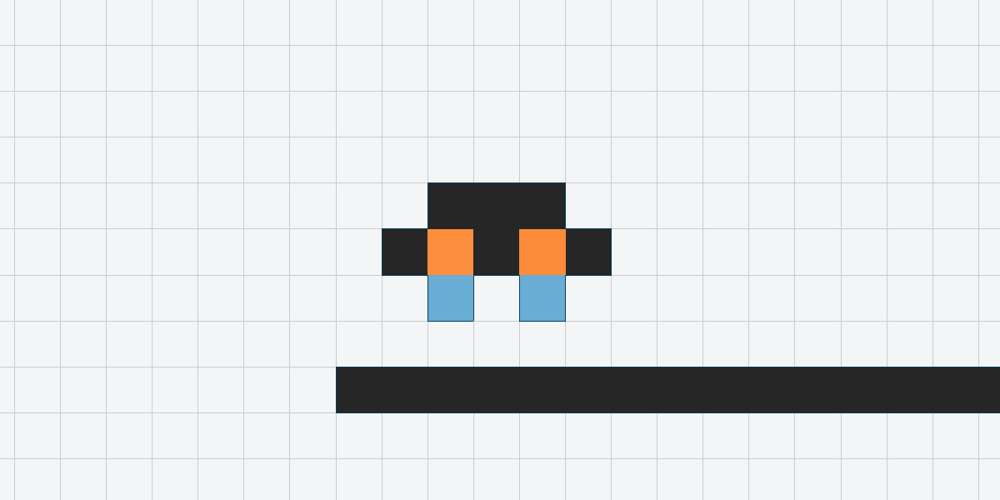
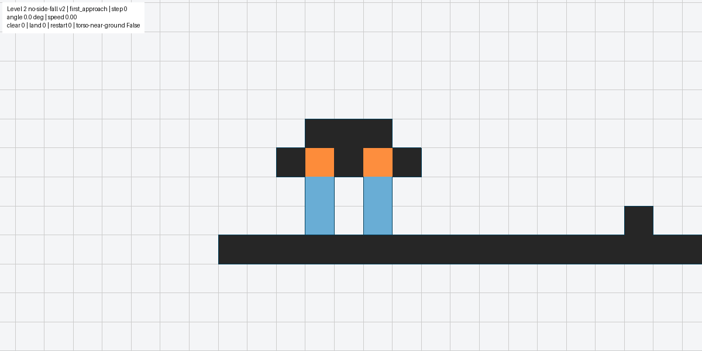
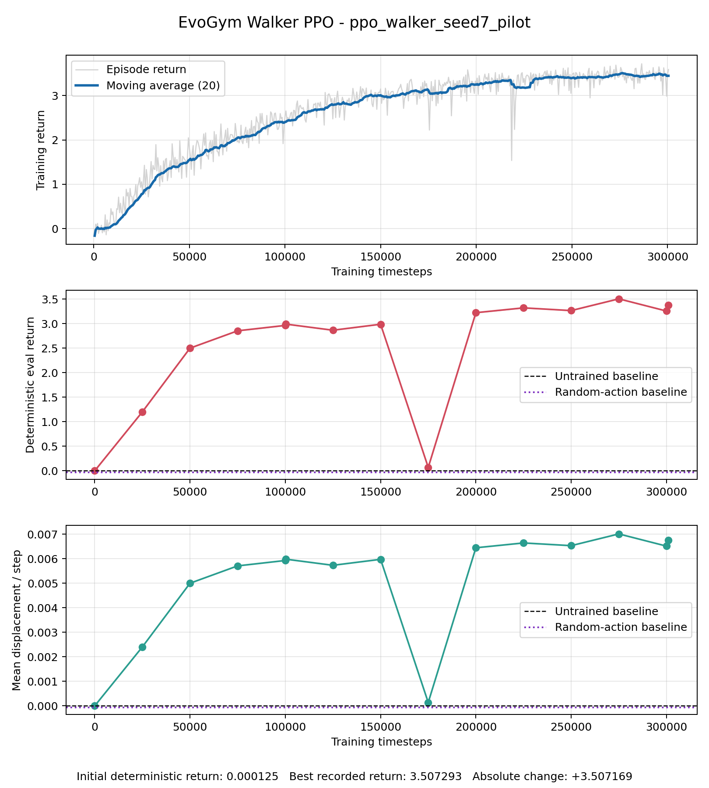
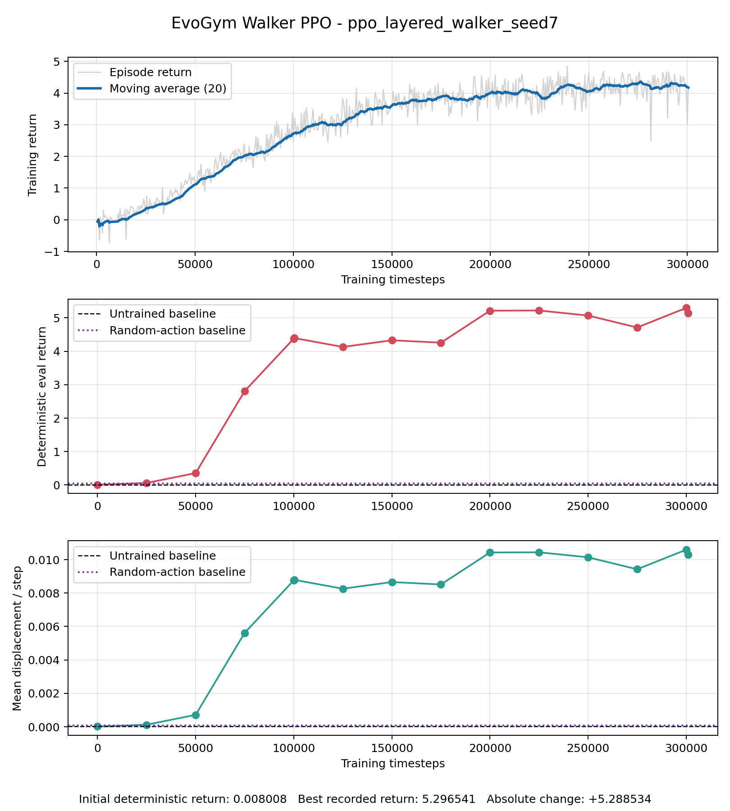
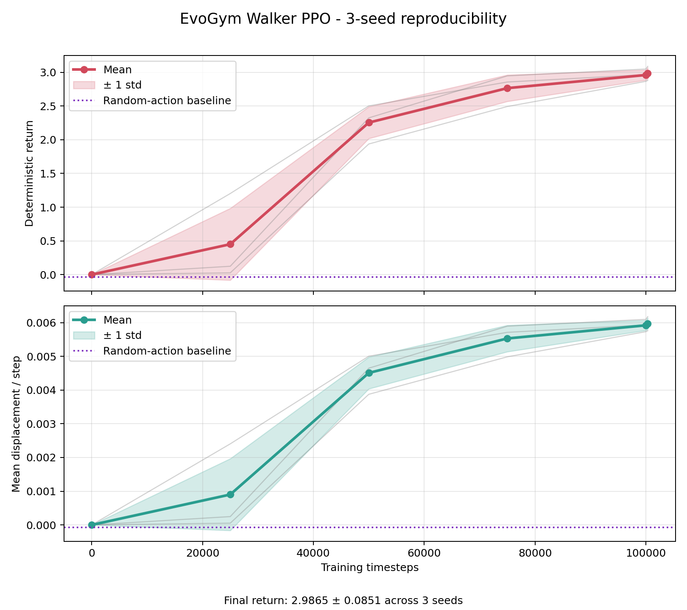

# Hallusync

> 本リポジトリ内では、最終提出物である `main` ブランチのみの参照を推奨します。

## プロジェクト概要

Hallusync は、EvoGym 上の軟体ロボットを対象に、強化学習による移動能力の獲得、身体構造の探索、障害物通過、階層制御、汎用方策への統合を段階的に検証したプロジェクトです。

研究全体は、独自実装を中心とする「自作強化学習と身体変化」と、PPOによる障害物学習を中心とする「PPOを用いた段階的越障学習と階層制御」の二つに分けて整理しています。二つの研究領域を別ディレクトリに保持することで、それぞれの目的、実装、実験結果を独立して確認できる構成にしています。

## メンバー

| 学籍番号 | 氏名 |
|---|---|
| k026c1071 | 清水凱生 |
| k026c1098 | 李昱彤 |
| k026c1084 | 石川孝汰 |
| k026c1091 | XUE XIAOTIAN |

## ディレクトリ構成

```text
Hallusync/
├─ README.md
├─ requirements.txt
├─ LICENSE
├─ .gitignore
├─ evogym_portfolio.pptx
├─ 自作強化学習と身体変化/
└─ PPOを用いた段階的越障学習と階層制御/
```

### [`自作強化学習と身体変化`](自作強化学習と身体変化/README.md)

`自作強化学習と身体変化` では既存のアルゴリズムを用いず、自作の強化学習コードと方策を開発したものを収録します。また、学習回数を重ねるとともに、身体が移動に適した形へ進化していく仕組みを実装しています。

自作方策は64ユニットの全結合ネットワークで、REINFORCEの収益計算、行動探索、方策更新を独自に実装しています。小規模な身体探索では、集団の平均適応度が第0世代の約0.00325から第1世代の約0.00549へ上昇しました。詳細な構成、実行方法、結果は [`自作強化学習と身体変化/README.md`](自作強化学習と身体変化/README.md) に記載しています。

補足の発表資料は [`evogym_portfolio.pptx`](evogym_portfolio.pptx) で確認できます。

### `PPOを用いた段階的越障学習と階層制御`

`PPOを用いた段階的越障学習と階層制御` では、平地移動を基礎として、可動障害物、固定障害物、長脚身体、複数の専門方策を組み合わせた階層制御、単一の汎用学生方策への統合を段階的に検証しています。

主な学習器には PPO を使用し、身体構造の比較、転移学習、カリキュラム学習、厳格な成功判定、教師・学生方式、因果検証を取り入れました。第四段階では、十個の専門方策を状態に応じて切り替えることで、長脚ロボットによる二つの固定障害物の通過、着地、再前進を実現しました。

第五段階では専門技能を単一の学生方策へ統合することを試みましたが、最終的な因果検証により、見かけ上の成功が地図境界の観測値に依存していたことが判明しました。そのため、未知の障害物へ一般化する汎用方策が完成したという主張は行わず、成功条件と失敗原因の両方を研究結果として記録しています。

詳細は [`PPOを用いた段階的越障学習と階層制御/README.md`](PPOを用いた段階的越障学習と階層制御/README.md) を参照してください。

## 研究全体の流れ

| 段階 | 内容 | 主な方法 | 結果 |
|---|---|---|---|
| 自作強化学習と身体変化 | 自作方策、固定身体学習、身体変化 | 自作REINFORCE、突然変異、選択 | 平均適応度が約0.00325から約0.00549へ上昇 |
| 1 | 平地移動 | PPO、身体比較、複数乱数種 | 原始身体と層状身体の両方が前進を獲得 |
| 2 | 可動障害物 | 転移学習、地形観測、PPO | 原始身体 3/7、層状身体 2/7 |
| 3 | 固定二壁 | カリキュラム、三身体比較 | 長脚身体のみ 2/2 を通過 |
| 4 | 長脚階層制御 | 十個の専門 PPO、状態機械 | 二壁の通過・着地・再前進を達成 |
| 5 | 汎用学生方策 | 模倣、PPO、逆カリキュラム、因果検証 | 境界観測への依存を確認し、汎化成功の主張を撤回 |

## 代表的な実行結果

### 原始身体の平地移動



### 十個の専門方策を用いた二障害物通過



## 第一段階の学習傾向

### 原始身体

学習の進行に伴って訓練リターン、決定論的評価リターン、平均移動量が上昇しました。途中に一時的な性能低下はありますが、その後回復し、最良評価リターンは 3.5073 となりました。



### 層状身体

層状身体でも学習とともに移動性能が向上し、最良評価リターンは 5.2965 となりました。ただし、この比較だけで一般的な身体性能の優位性を断定することはできません。



### 三乱数種での再現性確認

原始身体を三つの乱数種で再学習し、100,000 ステップ時点で平均リターン 2.9865、標準偏差 0.0851 を確認しました。



## 必要環境

- Windows 11
- Python 3.10
- EvoGym 2.0.0
- Gymnasium 1.3.0
- Stable-Baselines3 2.9.0
- sb3-contrib 2.9.0
- PyTorch 2.13.0

依存ライブラリの完全な一覧は `requirements.txt` および `PPOを用いた段階的越障学習と階層制御/requirements/` に記載しています。EvoGym 本体のソースコードは本リポジトリへ複製せず、Python パッケージとして導入します。

## 環境構築

PowerShell でリポジトリのルートを開き、以下を実行します。

```powershell
py -3.10 -m venv .venv
.\.venv\Scripts\python.exe -m pip install --upgrade pip
.\.venv\Scripts\python.exe -m pip install -r .\requirements.txt
```

## `PPOを用いた段階的越障学習と階層制御` の再評価例

### 平地移動

```powershell
Set-Location ".\PPOを用いた段階的越障学習と階層制御\setsu_01_flat_locomotion"
$env:PYTHONPATH = (Get-Location).Path
..\..\.venv\Scripts\python.exe -m src.evaluate_submission --body original --episodes 3
```

### 長脚ロボットの二壁階層制御

```powershell
Set-Location ..\setsu_04_long_legged_hierarchical
$env:PYTHONPATH = (Get-Location).Path
..\..\.venv\Scripts\python.exe -m ll7.final_true_noroll_v2 --output .\results\level2_v2\recheck.json
```

### 汎用学生プロジェクトの自動試験

```powershell
Set-Location ..\setsu_05_general_obstacle_student
$longLegPath = (Resolve-Path ..\setsu_04_long_legged_hierarchical).Path
$env:PYTHONPATH = "$(Get-Location);$longLegPath"
..\..\.venv\Scripts\python.exe -m pytest -q
```

## 工夫した点

- 独自実装による研究とPPOを用いた研究を分離し、それぞれの目的と成果を追跡できるようにしました。
- 成功を重心位置だけで判断せず、身体全体の通過、着地、姿勢、接地、一定時間の安定を分けて評価しました。
- 単一方策で難しい障害物通過を、接近、通過、着地、再前進の専門方策へ分解しました。
- 教師を使用する訓練と、教師を完全に停止する最終評価を分離しました。
- 成功例だけでなく、学習停滞、破滅的忘却、観測依存などの負の結果も保存しました。
- 見かけ上の成功に対して観測条件を変更し、必要性と十分性を調べる因果検証を行いました。

## 制約

- すべての障害物へ一般化する単一方策は得られていません。
- 身体比較の一部は乱数種と初期化経路が限定されているため、一般的な形態優位性までは断定できません。
- 結果は EvoGym シミュレーション上のものであり、実機性能を直接示すものではありません。
- 学習過程の全チェックポイントや数 GB 規模の中間軌跡は、提出容量を抑えるため収録していません。

## ライセンスと出典

本プロジェクトは MIT License の EvoGym を利用しています。EvoGym 由来部分、利用ライブラリ、課題固有部分の関係は [`PPOを用いた段階的越障学習と階層制御/docs/ATTRIBUTION.md`](PPOを用いた段階的越障学習と階層制御/docs/ATTRIBUTION.md) に記載しています。ライセンス原文は `LICENSE` および `PPOを用いた段階的越障学習と階層制御/LICENSE` に保存しています。
