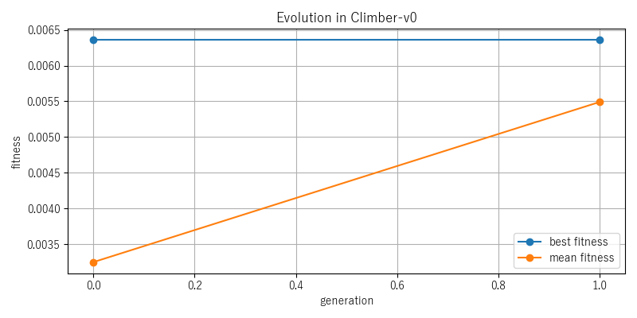
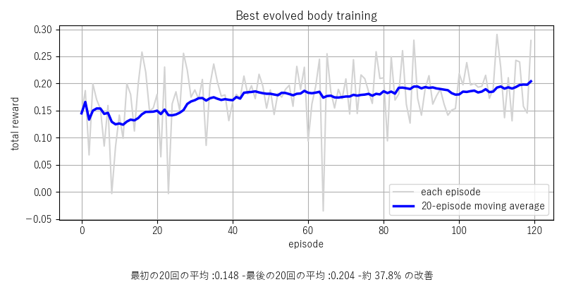
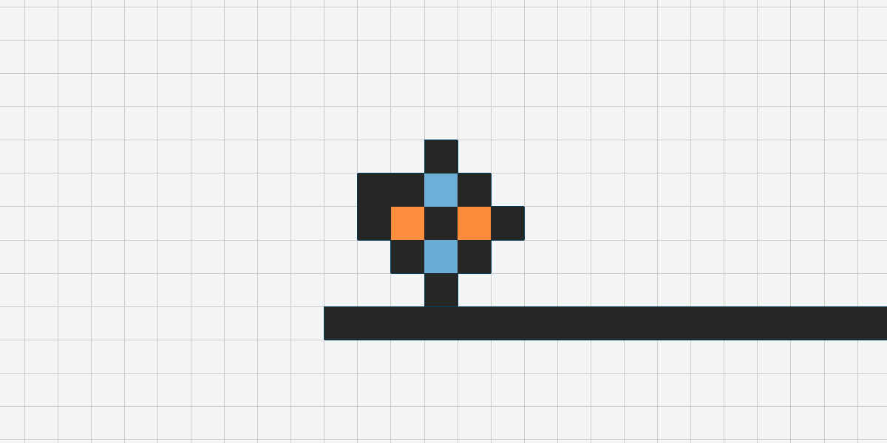
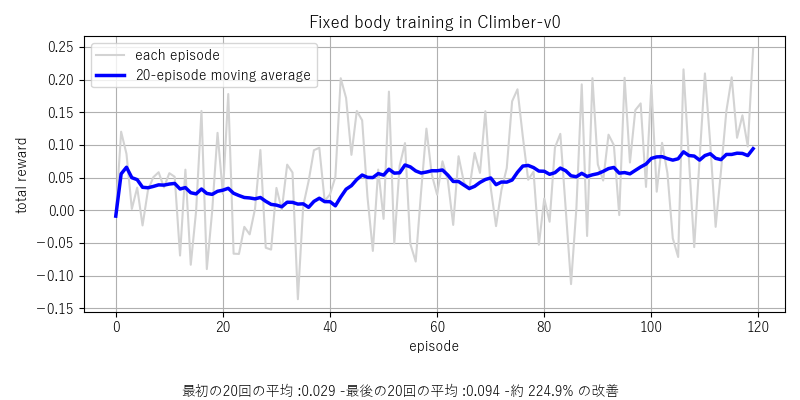
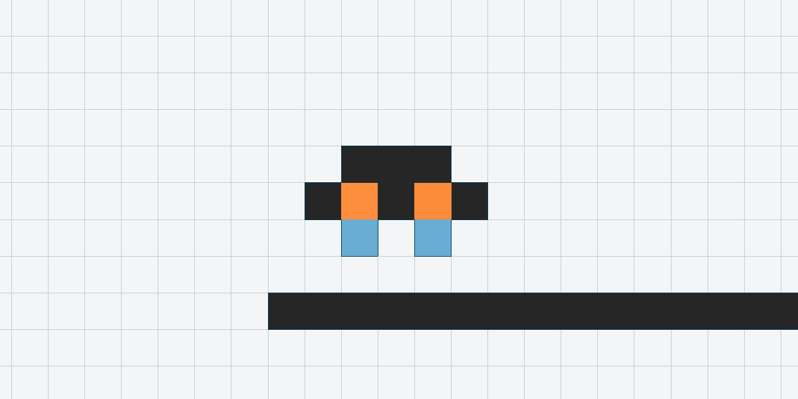

# 自作強化学習と身体変化

## 概要

本ディレクトリには、EvoGym の環境を利用しながら、既存の強化学習アルゴリズム実装に依存せず、方策ネットワーク、行動選択、収益計算、方策更新を自作した実験を収録しています。

固定身体に対する強化学習に加え、身体を突然変異させ、短期学習後の評価値を基準に次世代の身体を選ぶ仕組みを実装しました。これにより、「動作を学習する方策」と「移動に適した身体構造」を同時に探索するための基礎を作成しています。

## ディレクトリ構成

```
text
自作強化学習と身体変化/
├─ README.md
├─ src/
│  ├─ body.py            身体定義と突然変異
│  ├─ policy.py          自作方策ネットワーク
│  ├─ reinforce.py       自作REINFORCE
│  ├─ evolve.py          身体選択と世代更新
│  ├─ train_fixed.py     保存身体の追加学習
│  ├─ render_demo.py     保存方策のGIF生成
│  ├─ plot_results.py    学習・進化曲線の生成
│  └─ check_env.py       環境の動作確認
├─ results/              身体、方策、CSV、グラフ、GIF
└─ bodychange_test.py    身体突然変異の簡易確認
```


## 実行方法

・実行するコードは主にtrain_fixed.pyとrender_demo.pyです。
実行する際は、python -m スクリプト名（.pyは含めない）で実行します

## 必要な環境

●Python3.7から3.10で動作します

●要件
Python3
Visual Studios(C++でのデスクトップ開発をインストール)
Cmake
PyTorch

●インストール

[リポジトリとサブモジュールをダウンロード]
git clone --recurse-submodules https://github.com/EvolutionGym/evogym.git
[evogymダウンロード]
pip install -e .
[画像等の出力と強化学習（PROなど）を実行させるライブラリインポート]
pip install stable-baselines3 imageio pygifsicle
[NEATとベイズ最適化のインストール]
pip install git+https://github.com/yunshengtian/neat-python@2762ab630838520ca6c03a866e8a158f592b0370
pip install git+https://github.com/yunshengtian/GPyOpt@5fc1188ffdefea9a3bc7964a9414d4922603e904


## 必要ライブラリ（上記のインストールを行うと全て入ります）
【A】Python 基盤ライブラリ
・numpy
・gym
・pybind11 
【B】機械学習・計算ライブラリ
・torch (PyTorch)
・stable-baselines3
・scipy
【C】改造ライブラリ
・neat-python　
・GPyOpt
【D】画像等の出力
imageio (動画保存用)
pygifsicle (GIFの最適化用)
matplotlib (グラフ描画用)

## 実行したスクリーンショット


## 工夫した点

進化する際に体の一つだけの筋肉をへんかさせる事で、ランダム性と安定性を確保した。

また、学習結果をグラフ化するときに全ての学習結果を出力するとデータにばらつきがあり結果が分かりにくかった。
その為、複数回数のデータの平均をとることで分かりやすくした。

## 自作方策ネットワーク

観測値を入力し、64ユニットの全結合層と `Tanh` を通して、各アクチュエータの行動平均を出力します。

```text
観測 → Linear(64) → Tanh → Linear(行動数) → 行動平均
```

学習時は平均行動の周囲に標準偏差 `0.20` の正規分布を設定し、探索行動を生成します。出力は EvoGym の行動範囲へ変換してから環境へ渡します。

### 自作強化学習

方策勾配法である REINFORCE の基本処理を自作しました。

- 割引率：`0.99`
- 最適化：Adam
- 学習率：`0.0003`
- 各時刻以降の割引収益を計算
- 収益をエピソード内で標準化
- 良い結果につながった行動の対数確率を高めるように方策を更新

実装は `src/reinforce.py` と `src/policy.py` にあります。

### 身体変化

身体は5×5の材料配列として表現しています。突然変異では、既存身体に隣接する空白へ60%の確率で新しい材料を追加し、それ以外の場合は既存材料を変更します。動作不能な身体を避けるため、突然変異後にアクチュエータが一つもない場合は必ず追加します。

### 身体選択

`src/evolve.py` では以下の小規模な進化実験を実装しています。

| 項目 | 設定 |
|---|---:|
| タスク | `Climber-v0` |
| 集団数 | 3 |
| 世代数 | 2 |
| 個体ごとの短期学習 | 10エピソード |
| 評価 | 2エピソード |
| 最大ステップ | 500 |

各個体に新しい方策を与えて短期学習し、決定論的な平均行動で評価した値を適応度とします。各世代の最良身体を残し、その突然変異体によって次世代を作成します。

## 主な結果

### 身体進化

二世代の小規模実験では、最高適応度は `0.006358` で変化しませんでした。一方、集団の平均適応度は第0世代の約 `0.00325` から第1世代の約 `0.00549` へ上昇しました。



この結果は探索機構が動作したことを示しますが、世代数と個体数が少ないため、身体進化の一般的な有効性を証明するものではありません。

### 選択身体の追加学習

選択された身体を120エピソード学習した結果、最初の20エピソードの平均報酬 `0.148` に対し、最後の20エピソードは `0.204` となり、約37.8%上昇しました。



学習前：



学習後：


### 固定身体の学習

固定身体では最初の20エピソードの平均報酬 `0.029` に対し、最後の20エピソードは `0.094` となりました。



学習前：



学習後：


```


### 環境確認

```powershell
..\.venv\Scripts\python.exe .\src\check_env.py
```

### 身体変化の確認

```powershell
..\.venv\Scripts\python.exe .\bodychange_test.py
```

### 保存済みモデルのGIF生成

```powershell
..\.venv\Scripts\python.exe .\src\render_demo.py
```

### 固定身体の再学習

```powershell
..\.venv\Scripts\python.exe .\src\train_fixed.py
```

### 身体進化実験

```powershell
..\.venv\Scripts\python.exe .\src\evolve.py
```

### 結果グラフの再生成

```powershell
..\.venv\Scripts\python.exe .\src\plot_results.py
```

`train_fixed.py`、`evolve.py`、`render_demo.py`、`plot_results.py` は `results/` 内のファイルを更新するため、既存結果を保存したい場合は実行前にコピーを作成してください。

## 制約

- 身体進化実験は2世代、各世代3個体の小規模な動作確認です。
- 進化実験の最高適応度は第0世代から第1世代で更新されていません。
- 複数乱数種による統計的な再現性評価は行っていません。
- EvoGymの環境と報酬設計は外部ライブラリを利用しています。
- 本結果はシミュレーション上のものであり、実機性能を示すものではありません。

## 補足資料

リポジトリ直下の [`evogym_portfolio.pptx`](../evogym_portfolio.pptx) に、実験内容をまとめた発表資料を収録しています。
